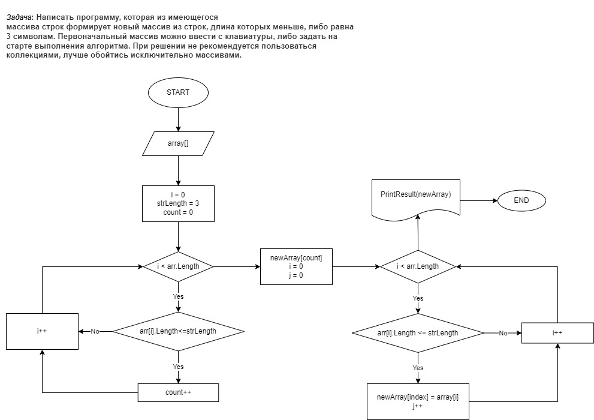

# Итоговая контрольная работа по основному блоку.

## Задание для выполнения

1. Создать репозиторий на GitHub
2. Нарисовать блок-схему алгоритма
3. Снабдить репозиторий оформленным текстовым описанием решения (файл README.md)
4. Написать программу, решающую поставленную задачу
5. Использовать контроль версий в работе над этим небольшим проектом

### Задача
> Написать программу, которая из имеющегося массива строк формирует новый массив из строк, длина которых меньше, либо равна 3 символам. Первоначальный массив можно ввести с клавиатуры, либо задать на старте выполнения алгоритма. При решении не рекомендуется пользоваться коллекциями, лучше обойтись исключительно массивами.
>>Примеры:
[“Hello”, “2”, “world”, “:-)”] → [“2”, “:-)”]
[“1234”, “1567”, “-2”, “computer science”] → [“-2”]
[“Russia”, “Denmark”, “Kazan”] → []

## Репозиторий на GitHub
`https://github.com/IrynaTich13/final_work_1.git`

## Блок схема основного метода

## Описание решения задачи
Для решения задачи используем три метода. 
- С помощью метода ***QuantityStringSmallLength*** находим количество строк, длина которых меньше или равна заданному значению. Результатом метода является числовое значение int, которое используется в создании нового массива.
- Метод ***NewArray*** создаёт новый массив и заполняет его строками, которые меньше, чем заданное значение.
- Метод ***PrintResult*** выводит в консоль новый массив.

## Решение задачи
Решение задачи на языке C# находится в папке **ControlTask**.

